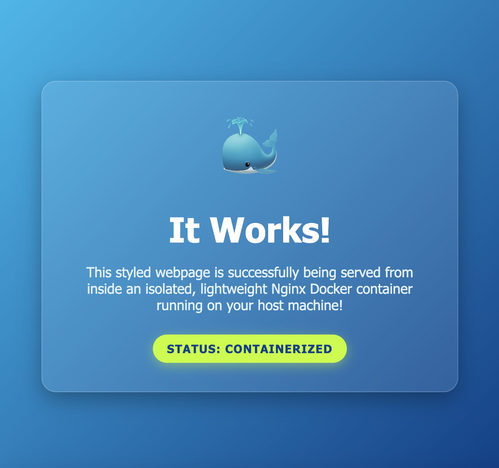

# Docker First Webpage

This project demonstrates how to containerize a simple HTML webpage using Docker and Nginx.

## Files

- `index.html` - The webpage served by Nginx.
- `Dockerfile` - Docker instructions for building the image.

## Build the Image

```bash
docker build -t my-web-app .
```

## Run the Container

```bash
docker run -d -p 8080:80 --name local-web-container my-web-app
```

## View the Webpage

Open the following URL in your browser:

```
http://localhost:8080
```

## Screenshot


